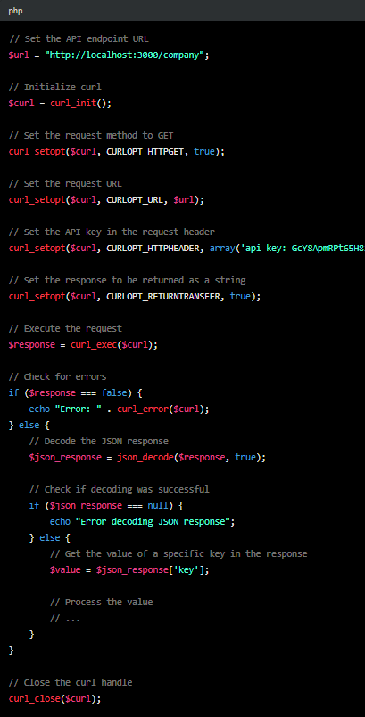

# Readme for Node.js and Express API
This Node.js and Express API is designed to serve different endpoints related to our company, its teams and products. The API is protected by an API key that needs to be provided in the header of each request.

# Requirements
This API requires Node.js to be installed on your machine. You can download it from the official website.

# Installation
- Clone the repository:
git clone https://github.com/brightbytetechnologies/bevbotrest.git
- Navigate to the project folder:
cd path/to/localclones/bevbotrest
- Install the dependencies:
npm install

# Usage
API Key
To use the API, you need to provide a valid API key in the api-key header of each request. The API key is defined in the API_KEY constant at the top of the index.js file. You should replace this value with your own API key.

Endpoints
The following endpoints are available:

- GET /company
Returns information about the company / logo.

- GET /homepage
Returns information for the homepage of the company.

- GET /managment
Returns information about the company's management team.

- GET /software
Returns information about the company's software team.

- GET /hardware
Returns information about the company's hardware team.

- GET /products
Returns a list of the company's products and the needed information.

- GET /protected
A protected endpoint that can only be accessed with a valid API key.

# Example
Here's an example of how to use the API with PHP:

